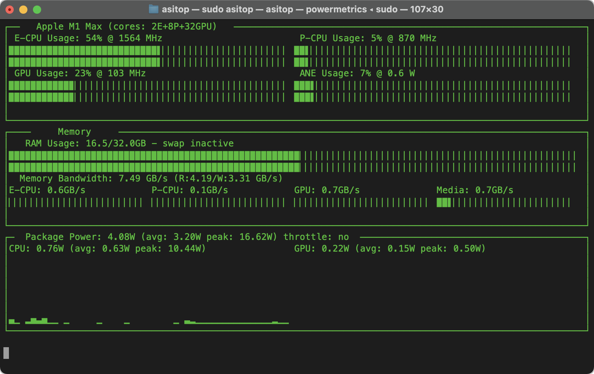

# asitop

Performance monitoring CLI tool for Apple Silicon



```shell
pip install asitop
```

## What

A Python-based `nvtop`-style command line tool for Apple Silicon (aka M1) Macs.

* Utilization info:
  * CPU (E-cluster and P-cluster), GPU
  * Frequency and utilization (active residency)
* Memory info:
  * RAM and swap, size and usage
  * Memory bandwidth (CPU/GPU)
* Power info:
  * Package power, CPU power, GPU power
  * Chart for CPU/GPU power
  * Remember peak power

Note that it requires `sudo` to run due to macOS `powermetrics` needing root access to run.

## How

After you install via pip, you can use it via the Terminal.

```shell
# it will prompt you for password on start
asitop

# to enter password before start
sudo asitop
```

## Why

Because I didn't find something like this online. Also, just curious about stuff.

## Disclaimers

I did this in a few hours don't blame me if it fried your new MacBook or something.
